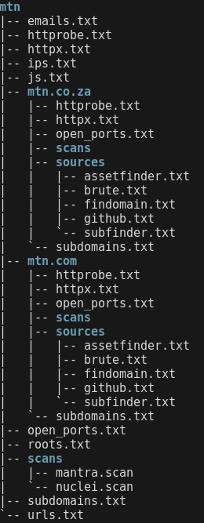

#### ABOUT

You might be thinking this is just another recon framework like the hundred others well your exactly right I wrote this because reconftw didn't work. This framework is nothing special though it does have some unique features I don't see in others like reverse ip searches which can yield many results. Sakura is also very configurable to each program or target with options for using proxychains and passive and active recon and reverse ip searches since every target is different. The most important feature is that it outputs all the recon in a directory which is nicely formatted and is in a format where you can just start to do manual recon on it straight away it's actually organized the way I organize my recon. 




If you have an unstable computer it can also be ran in stages like doing subdomains then fingerprinting, etc instead of all at once so if something happens you can pick up from your most recent stage. It also uses dnsx instead of puredns for dns brute forcing since puredns makes alot of peoples dns servers stop working.

#### INSTALLATION

###### SETUP

First you need some resolvers which are used for dns brute forcing sakura uses the resolvers in the ~/resolvers.txt directory. You can get resolvers with the command `dnsvalidator -tL https://public-dns.info/nameservers.txt -threads 40 -o ~/resolvers.txt` or from online. After you have resolvers nuclei uses custom templates in the ~/mytemplates directory. If you don't have custom nuclei templates you can use mine from `https://github.com/j0w-w/mytemplates/tree/main/mytemplates`. After all your templates and resolvers are set up also you need new resolvers each time you do dns brute forcing you can install the tool.
Also you need your own github tokens in the `github-tokens.txt` file and when dns brute forcing the `wordlist.txt` file is used to change it if you must.

###### INSTALLING

Run the command `git clone https://github.com/j0w-w/sakura.git` and change directory into sakura then run the command `sudo ./install_dependencies.sh`. Then `chmod +x ./sakura.py` then your ready to run the tool.

#### USAGE

An example command for sakura will look like this `cat domains.txt | ./sakura.py mtn 2133 true`. The domains file is full of the domains you want to test the mtn is the project directory to use and the numbers are the settings and the true is to use proxychains false for no.

```
    x               x               x               x
    subdomains      fingerprinting  urls            scanning
```

An important thing to note is that this can be run in sections like you can do subdomains first like `3000` then leave the rest as zeros then later if you want urls you can do `0130`. But you can't skip sections you have to do one after the other you can't just go straight from subdomains to scanning in sections. Or you have no zeros and the tool will just be ran straightforward though I prefer it in sections in case something crashes so I can start of from last section. For proxies it just uses proxychains4 so you need to have your own proxies configured.

###### SUBDOMAINS

0. Pass move onto next
1. Get subdomains from passive sources
2. Get subdomains from passive sources and dns brute forcing
3. Get subdomains from brute forcing
4. Get subdomains from passive sources and dns brute forcing and reverse dns
5. Get subdomains from passive sources and reverse dns
6. Get subdomains from brute forcing and reverse dns

###### FINGERPRINTING

0. Pass move onto next
1. Port scan and get web servers and fingerprint web servers

###### URLS

0. Pass move onto next
1. Gather urls passively and extract js files and emails
2. Gather urls actively and extract js files and emails
3. Gather urls passively and actively and extract js files and emails

###### SCANNING

0. Pass move onto next
1. Scan js files
2. Scan web applications
3. Scan js files and web applications


#### TOOLS USED

###### PROXIES

1. proxychains4

###### SUBDOMAINS

1.  subfinder
2.  assetfinder
3.  findomain
4.  github-subdomains
5.  puredns
6.  dnsx

###### FINGERPRINTING

1. naabu
2. httpx
3. httprobe

###### URLS

1. gospider
2. katana

###### SCANNING

1. nuclei
2. mantra

